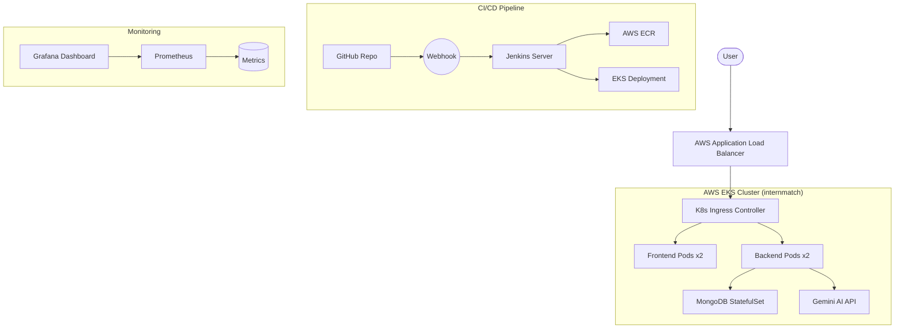

# InternMatch: Enterprise DevOps Architecture

This document outlines the production-grade DevOps implementation for the InternMatch project.

## 🏗 Architecture Overview



## 📂 Folder Structure

```text
internMatch/
├── client/                 # Frontend React App
│   ├── Dockerfile          # Multi-stage production build
│   └── nginx.conf          # SPA Routing config
├── server/                 # Backend Node.js App
│   └── Dockerfile          # Optimized production image
├── k8s/                    # Kubernetes Manifests
│   ├── namespace.yaml      # Project isolation
│   ├── mongodb.yaml        # Database deployment
│   ├── backend.yaml        # API deployment
│   ├── frontend.yaml       # Web deployment
│   ├── ingress.yaml        # Routing & ALB setup
│   └── hpa.yaml            # Auto-scaling rules
├── terraform/              # Infrastructure as Code
│   ├── main.tf             # AWS Provider
│   ├── vpc.tf              # Network setup
│   ├── eks.tf              # Kubernetes cluster
│   └── ecr.tf              # Image registry
├── monitoring/             # Monitoring & Logging
│   ├── prometheus.yaml
│   └── grafana.yaml
├── docker-compose.yml      # Local development setup
└── Jenkinsfile             # CI/CD Pipeline logic
```

## 🚀 Deployment Steps

### 1. Provision Infrastructure
```bash
cd terraform
terraform init
terraform apply -auto-approve
```

### 2. Configure Kubernetes
```bash
aws eks update-kubeconfig --region us-east-1 --name internmatch-eks
kubectl apply -f k8s/namespace.yaml
```

### 3. Setup Secrets
```bash
kubectl create secret generic backend-secrets \
  --from-literal=jwt-secret='YOUR_JWT_SECRET' \
  --from-literal=gemini-api-key='YOUR_GEMINI_KEY' \
  -n internmatch
```

### 4. CI/CD Setup
- Connect your GitHub repository to Jenkins.
- Add a Webhook pointing to `http://YOUR_JENKINS_URL/github-webhook/`.
- Create a 'Pipeline' job in Jenkins using the provided `Jenkinsfile`.

## 🛡 Security & Best Practices
- **Non-Root Images**: Containers run as non-privileged users.
- **Resource Constraints**: CPU/Memory limits prevent "noisy neighbor" issues.
- **Network Isolation**: VPC with private subnets for sensitive components.
- **Auto-Scaling**: HPA automatically scales pods based on CPU utilization.
- **Readiness/Liveness Probes**: Ensure zero-downtime deployments.

## 📊 Monitoring
Access Grafana at `http://GRAFANA_SERVICE_URL:3000` to view real-time metrics for:
- Pod CPU/Memory utilization.
- Request latency.
- Error rates.
